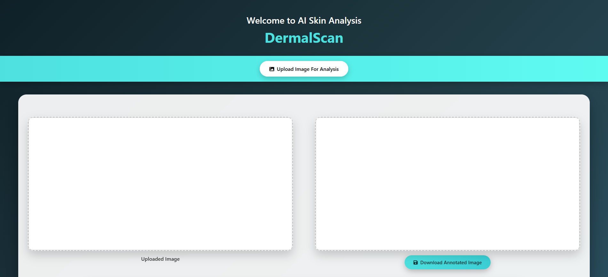
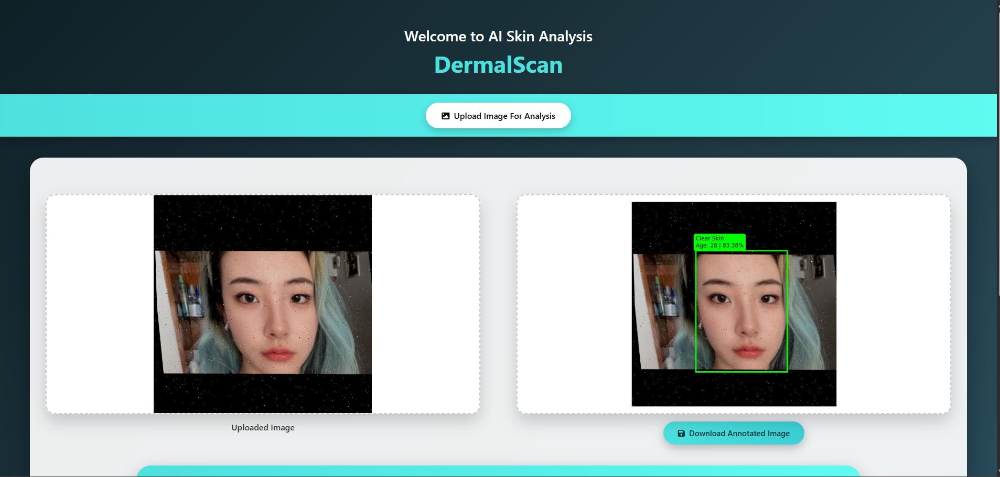
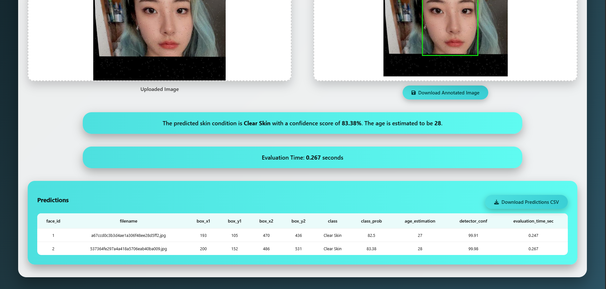

# 🧴 DermalScan – AI-Powered Skin Analysis System


[](https://dermalscan-ai-skin-analysis.onrender.com)

## 🌐 Live Demo

<p align="center">
  <a href="https://dermalscan-ai-skin-analysis.onrender.com"><b>🔗 Access Live Demo</b></a>
</p>

> ⏳ **Note:** The application may take 10–30 seconds to load on first access due to cold start behavior on Render's free tier.


<p align="center">
  <b>DermalScan</b> is an AI-powered web application that analyzes facial images to detect skin conditions, estimate age, and visualize results using deep learning and computer vision techniques.
</p>

---

## 📌 Project Overview

DermalScan provides an end-to-end solution for facial skin analysis using a modern web interface and a robust backend inference pipeline.  
The system supports **single-face and multi-face images**, generates **annotated visual outputs**, logs predictions, and allows **exporting results** for further analysis.

## ✨ Key Features

- Image upload with real-time preview
- Deep Neural Network (DNN) based face detection
- Non-Maximum Suppression (NMS) for multi-face handling
- CNN-based skin condition classification
- Age estimation using confidence-based mapping
- Adaptive annotations for crowded images
- Prediction summary (single & multiple faces)
- Evaluation time tracking (seconds)
- CSV and annotated image export
- Responsive and clean UI

---

## 🧠 Technologies Used

### Frontend
- HTML5
- CSS3
- Vanilla JavaScript

### Backend
- Python 3.10
- Flask 3.0.0
- TensorFlow 2.15.0
- OpenCV (DNN Module)
- NumPy
- Matplotlib

---

## 👤 User Guide

**Note:** Before proceeding with the user guide, ensure you have completed the **Installation & Setup** steps outlined below.

### 1️⃣ Launching the Application
Run the Flask server and open:
http://127.0.0.1:5000

### 2️⃣ Uploading an Image
- Click **“Upload Image for Analysis”**
- Select an image with one or more faces
- Uploaded image preview appears instantly

### 3️⃣ Viewing Analysis Results
After processing:
- Annotated image is displayed with bounding boxes
- Each detected face shows:
  - Skin condition
  - Estimated age
  - Confidence score
- Result box displays:
  - Detailed output for single-face images
  - Summary analysis for multi-face images
- Evaluation time (in seconds) is shown below the result

### 4️⃣ Prediction Table
Each prediction is logged with:
- Face ID
- Bounding box coordinates
- Predicted skin condition
- Confidence score
- Estimated age
- Detector confidence
- Evaluation time

### 5️⃣ Export Options
- **Download Annotated Image**
- **Download Predictions CSV**

---

## 📸 Application UI Examples

Here are some screenshots of the DermalScan application interface:








---

## 🧑‍💻 Developer Guide

### 📁 Project Structure
```
AI_DermalScan/
│
├── app.py                          # Main Flask application
├── requirements.txt                # Python dependencies
├── README.md                       # Project documentation
├── LICENSE                         # MIT License
├── AI_DermalScan_Documentation.pdf # Detailed project documentation
├── dataset_split.py                # Dataset splitting script
├── deploy.prototxt                 # OpenCV face detection config
├── res10_300x300_ssd_iter_140000.caffemodel  # OpenCV face detection model
├── haarcascade_frontalface_default.xml  # Alternative face detection
├── Dataset/                        # Training dataset
├── Dataset_split/                  # Split dataset for training/validation
├── Outputs/                        # Generated output files
├── static/                         # Static web assets (CSS, JS, images)
│   ├── css/
│   ├── uploads/                    # Uploaded images
│   └── outputs/                    # Annotated output images
├── templates/                      # HTML templates
│   └── index.html                  # Main web interface
└── visualizations/                 # Data visualization outputs
```

### ⚙️ Backend Pipeline Overview

1. Image upload handled via Flask
2. Face detection using OpenCV DNN (SSD model)
3. Non-Maximum Suppression removes overlapping boxes
4. Face preprocessing and normalization
5. CNN model predicts skin condition
6. Age estimation derived from confidence score
7. Matplotlib renders annotated output
8. Predictions stored in session memory
9. Structured JSON response sent to frontend

### 🧠 Key Concepts Explained

| Concept | Description |
|------|------------|
| **DNN** | Deep Neural Network used for face detection |
| **Blob** | Preprocessed input format for DNN models |
| **NMS** | Removes overlapping face detections |
| **Tensor** | Multi-dimensional array used by deep learning models |
| **CNN** | Convolutional Neural Network for classification |
| **Session Storage** | Stores predictions during a user session |
| **Evaluation Time** | Total inference time per image |

### ⏱ Evaluation Time
Evaluation time is computed as:
time.time() - start_time

- Measured in **seconds**
- Represents total backend processing duration
- Logged per prediction and included in exports

### 🧪 Performance Summary

- Average processing time: **~2–4 seconds**
- Supports single and multi-face images
- Clean and adaptive visualization
- Stable for repeated interactive use

---

## 📦 Installation & Setup

### 1️⃣ Clone Repository
```bash
git clone -b kanishka https://github.com/Springboard-Mentor-DermalScan/AI-DermalScan_Batch9.git
```

### 2️⃣ Create Virtual Environment
```bash
python -m venv venv
venv\Scripts\activate  # On Windows
```

### 3️⃣ Install Dependencies
```bash
pip install -r requirements.txt
```

### 4️⃣ Run Application
```bash
python app.py
```

---

## 📄 License

**Author:** Kanishka Sugumar  
**Email:** kanishkasugumar.official@gmail.com  
**LinkedIn:** [LinkedIn Profile](https://www.linkedin.com/in/kanishkasugumar/)

This project is intended for educational and research purposes. It was created as part of the Infosys Springboard Virtual Internship program.

For more detailed information, please refer to the [AI_DermalScan_Documentation.pdf](AI_DermalScan_Documentation.pdf).
